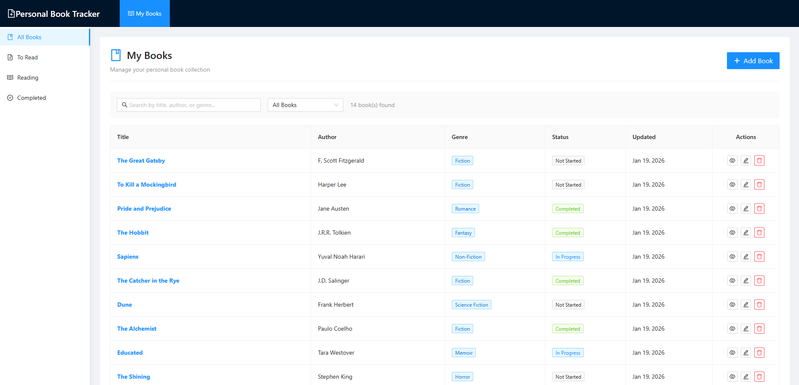
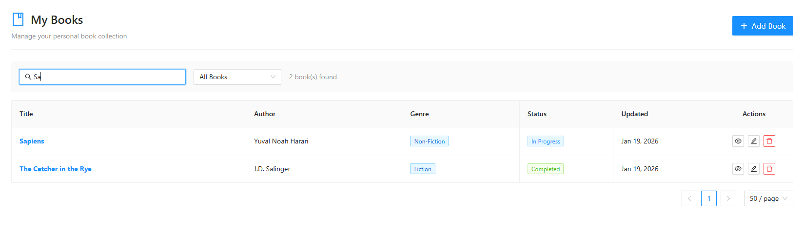
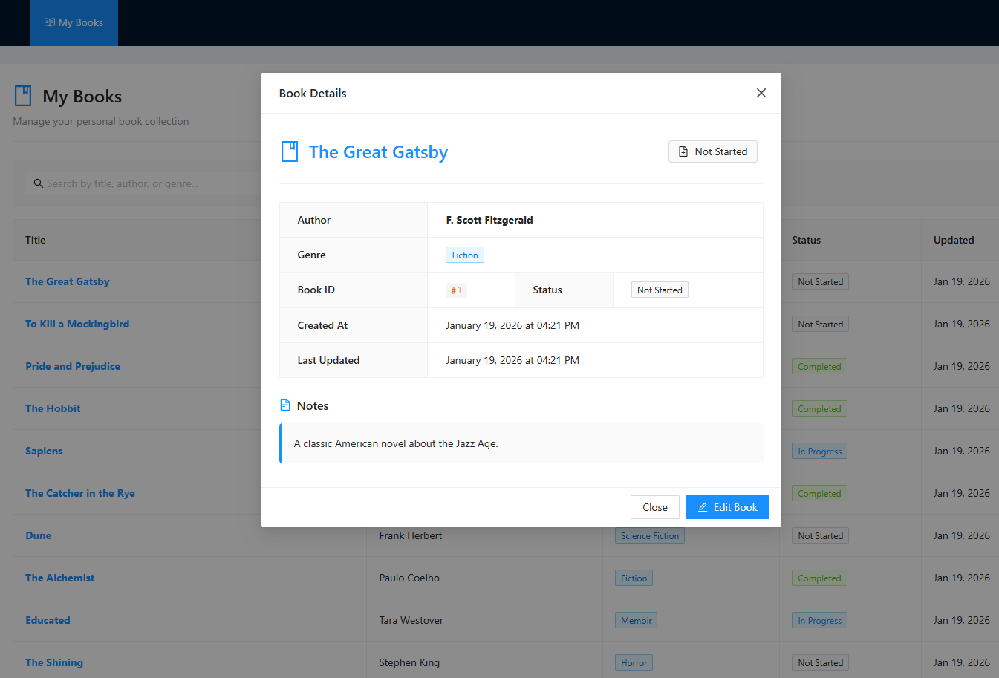
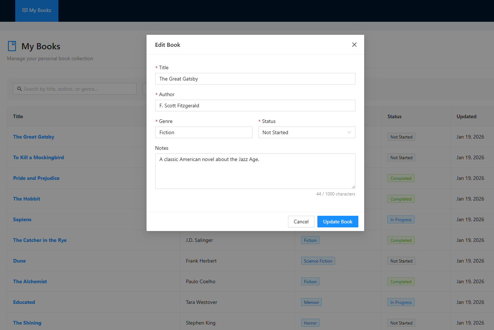
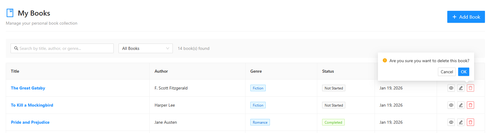

# 📚 Personal Book Tracker - Frontend

> A modern, lightweight Angular application for tracking your personal book collection.

[](https://angular.io/)
[](https://www.typescriptlang.org/)
[](https://ng.ant.design/)
[](LICENSE)

**Personal Book Tracker** is the frontend component of a full-stack MVP application that allows users to manage their book collection with ease. Track books you've read, are currently reading, or plan to read—all through an intuitive, responsive interface built with Angular and Ng-Zorro Ant Design.

---

## ✨ Features

### 📖 Book Management
- **Add Books** - Create new book entries with title, author, genre, status, and notes
- **Edit Books** - Update book information through modal forms
- **View Details** - See comprehensive book information in a detailed modal view
- **Delete Books** - Remove books from your collection with confirmation dialogs
- **List View** - Browse all books in a paginated, sortable table

### 🔍 Search & Filter
- **Real-time Search** - Search by title, author, or genre instantly
- **Status Filtering** - Filter books by reading status (Not Started, In Progress, Completed)
- **Dynamic Results** - See filtered results count in real-time

### 📊 Status Tracking
Track your reading progress with three distinct statuses:
- 🆕 **Not Started** - Books on your to-read list
- 📖 **In Progress** - Currently reading
- ✅ **Completed** - Finished books

### 🎨 Modern UI/UX
- Responsive layout with collapsible sidebar
- Clean Ant Design components
- Loading states and empty state handling
- Toast notifications for user feedback
- Confirmation dialogs for destructive actions
- Modal-based forms for add/edit operations

---

## 🎥 Demo

### Video Walkthrough

Watch the complete application demo:

<div align="center">
  <a href="https://youtu.be/2EpK6Azl-nk">
    
  </a>
  <p><i>Click to watch on YouTube</i></p>
</div>

### Screenshots

<table>
  <tr>
    <td width="50%">
      
      <p align="center"><b>Main Application View</b><br/>Book list with search and filter capabilities</p>
    </td>
    <td width="50%">
      
      <p align="center"><b>Search & Filter</b><br/>Real-time search and status filtering</p>
    </td>
  </tr>
  <tr>
    <td width="50%">
      
      <p align="center"><b>Book Details</b><br/>Comprehensive book information view</p>
    </td>
    <td width="50%">
      
      <p align="center"><b>Edit Book</b><br/>Modal form with validation</p>
    </td>
  </tr>
  <tr>
    <td colspan="2" align="center">
      
      <p align="center"><b>Confirmation Dialog</b><br/>Safe deletion with user confirmation</p>
    </td>
  </tr>
</table>

---

## 🛠️ Tech Stack

- **Framework:** [Angular 20](https://angular.io/) (Standalone Components)
- **UI Library:** [Ng-Zorro Ant Design 20](https://ng.ant.design/)
- **Language:** [TypeScript 5.9](https://www.typescriptlang.org/)
- **Styling:** SASS/SCSS
- **State Management:** Angular Signals (built-in)
- **HTTP Client:** Angular HttpClient with RxJS
- **Forms:** Reactive Forms with validation
- **Icons:** Ant Design Icons

---

## 📁 Project Architecture

```
src/
├── app/
│   ├── components/
│   │   ├── book-list/         # Main table view with search & filter
│   │   ├── book-form/          # Modal form for add/edit
│   │   └── book-detail/        # Modal for viewing book details
│   ├── models/
│   │   ├── book.interface.ts   # TypeScript interfaces
│   │   └── book-status.enum.ts # Status enumeration
│   ├── services/
│   │   └── book.service.ts     # HTTP service for API calls
│   ├── interceptors/
│   │   └── error.interceptor.ts # Global error handling
│   ├── app.config.ts           # Application configuration
│   ├── app.routes.ts           # Routing configuration
│   └── app.ts                  # Root component
├── environments/
│   ├── environment.ts          # Development environment
│   └── environment.prod.ts     # Production environment
└── styles.sass                 # Global styles
```

### Key Components

#### **App Component**
Main layout with header, sidebar navigation, and router outlet.

#### **Book List Component**
- Displays all books in a responsive table
- Search and filter functionality
- Pagination with customizable page sizes
- Action buttons (view, edit, delete)

#### **Book Form Component**
- Modal-based reactive form
- Validation for all fields
- Supports both create and update operations
- Character counter for notes field

#### **Book Detail Component**
- Read-only modal view
- Formatted book information
- Quick edit access

---

## 📋 Prerequisites

Before you begin, ensure you have the following installed:

- **Node.js** (v18.x or higher) - [Download](https://nodejs.org/)
- **npm** (v9.x or higher) or **yarn**
- **Angular CLI** (v20.x or higher)
  ```bash
  npm install -g @angular/cli
  ```
- **Backend API** - The Spring Boot backend must be running on `http://localhost:8080`

---

## 🚀 Getting Started

### 1. Clone the Repository

```bash
git clone <repository-url>
cd booktracker-frontend
```

### 2. Install Dependencies

```bash
npm install
```

### 3. Configure Environment

The application is pre-configured to connect to the backend at `http://localhost:8080/api`. If your backend runs on a different port, update the environment files:

**Development:** `src/environments/environment.ts`
```typescript
export const environment = {
  production: false,
  apiBaseUrl: 'http://localhost:8080/api'
};
```

**Production:** `src/environments/environment.prod.ts`
```typescript
export const environment = {
  production: true,
  apiBaseUrl: 'https://your-production-api.com/api'
};
```

### 4. Start the Development Server

```bash
npm start
# or
ng serve
```

The application will open at `http://localhost:4200/`

---

## 🔗 Backend Integration

This frontend requires the **Personal Book Tracker Backend** (Spring Boot) to be running.

### Backend Requirements

- **Base URL:** `http://localhost:8080`
- **API Prefix:** `/api`

### API Endpoints Used

| Method | Endpoint | Description |
|--------|----------|-------------|
| GET | `/api/books` | Retrieve all books |
| GET | `/api/books/{id}` | Get book by ID |
| POST | `/api/books` | Create a new book |
| PUT | `/api/books/{id}` | Update existing book |
| DELETE | `/api/books/{id}` | Delete a book |

### CORS Configuration

Ensure your backend has CORS configured to allow requests from `http://localhost:4200`:

```java
@Configuration
public class CorsConfig implements WebMvcConfigurer {
    @Override
    public void addCorsMappings(CorsRegistry registry) {
        registry.addMapping("/api/**")
                .allowedOrigins("http://localhost:4200")
                .allowedMethods("GET", "POST", "PUT", "DELETE", "OPTIONS")
                .allowedHeaders("*")
                .allowCredentials(true);
    }
}
```


---

## 🧩 Component Usage

### Using the Book Service

```typescript
import { BookService } from './services/book.service';
import { BookRequest } from './models/book.interface';

constructor(private bookService: BookService) {}

// Get all books
this.bookService.getAllBooks().subscribe(books => {
  console.log(books);
});

// Create a book
const newBook: BookRequest = {
  title: 'The Great Gatsby',
  author: 'F. Scott Fitzgerald',
  genre: 'Fiction',
  status: BookStatus.NOT_STARTED,
  notes: 'Classic American novel'
};

this.bookService.createBook(newBook).subscribe(book => {
  console.log('Created:', book);
});
```

### Working with Signals

This project uses Angular Signals for reactive state management:

```typescript
import { signal, computed } from '@angular/core';

// Create signals
books = signal<BookResponse[]>([]);
searchTerm = signal('');

// Computed values
filteredBooks = computed(() => {
  const term = this.searchTerm().toLowerCase();
  return this.books().filter(book => 
    book.title.toLowerCase().includes(term)
  );
});
```

---

## 🎨 Styling & Theming

The application uses Ng-Zorro's theming system with custom SASS variables.

### Global Theme Configuration

Located in `src/app/app.config.ts`:

```typescript
provideNzConfig({
  theme: {
    primaryColor: '#1890ff'  // Ant Design blue
  },
  message: {
    nzTop: 24,
    nzDuration: 3000,
    nzMaxStack: 7
  }
})
```

---

## 🚦 Running the Full Stack

### Step-by-Step Startup

#### Terminal 1: Backend
```bash
cd ../booktracker-backend
./mvnw spring-boot:run
# Wait for: "Started BooktrackerBackendApplication"
```

#### Terminal 2: Frontend
```bash
cd booktracker-frontend
npm start
# Wait for: "✔ Compiled successfully"
```

#### Browser
Open `http://localhost:4200` and start managing your books!

---

## 📚 Project Structure Details

### Models & Interfaces

**Book Interface** (`src/app/models/book.interface.ts`):
```typescript
export interface Book {
  id: number;
  title: string;
  author: string;
  genre: string;
  status: BookStatus;
  notes: string | null;
  createdAt: string;
  updatedAt: string;
}
```

**BookStatus Enum** (`src/app/models/book-status.enum.ts`):
```typescript
export enum BookStatus {
  NOT_STARTED = 'NOT_STARTED',
  IN_PROGRESS = 'IN_PROGRESS',
  COMPLETED = 'COMPLETED'
}
```

---

## 🤝 Contributing

Contributions are welcome! Please follow these steps:

1. **Fork** the repository
2. **Create** a feature branch: `git checkout -b feature/my-feature`
3. **Commit** your changes: `git commit -m 'Add my feature'`
4. **Push** to the branch: `git push origin feature/my-feature`
5. **Submit** a pull request

### Code Review Guidelines

- Ensure all tests pass
- Follow existing code style
- Update documentation as needed
- Add comments for complex logic

---

## 📄 License

This project is licensed under the MIT License - see the [LICENSE](LICENSE) file for details.

---

## 🙏 Acknowledgments

- [Angular Team](https://angular.io/) - For the amazing framework
- [Ng-Zorro Team](https://ng.ant.design/) - For the beautiful UI components
- [Ant Design](https://ant.design/) - For design inspiration

---

## 🔗 Related Projects

- **Backend Repository**: [Personal Book Tracker Backend](https://github.com/mjsamaha/booktracker-backend)

---

**Built with ❤️ using Angular and Ng-Zorro Ant Design**
